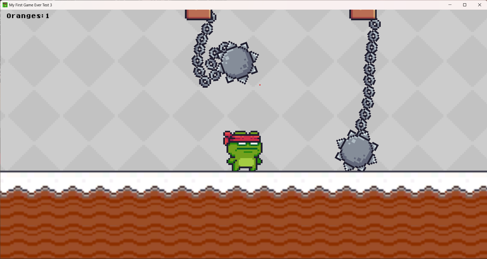

# 2D Platformer Game Assets
### Description
This is a repository of my first game that I made where you can play in 5 different platformer levels with different sceneries in each one

It uses many different functions of unity to create an immersive experience such as physics, basic enemy waypoint following, and animations for the player

This project was created using unity Version 2022.3.6f1

## Gameplay
# Level 3

# Level 4

# Level 5

